# Installation and configuration of Timescale
```dd-proxy``` recevies process data from the OPC data collector [dd-proxy](https://github.com/cyops-se/dd-proxy) and stores them in a Timescale timeseries database. A typical use case can be found in the [README](./README.md) for ```dd-proxy```.

## Step by step instruction (Windows Server 2012)
You must have administrator rights to complete this instruction
1. Make sure [Visual C++ Redistributable for Visual Studio 2015](https://www.microsoft.com/en-us/download/details.aspx?id=48145) is installed
2. Make sure you have a standard PostgreSQL 12 64-bit version installed and running. Instructions for a clean install of PostgreSQL can be found [here](#postgres-12-installation-instructions)
3. Download TimescaleDB binaries from [here](https://www.microsoft.com/en-us/download/details.aspx?id=48145). Link is also provided in the end of this instruction
4. Find the path to the ```postgresql.conf``` file
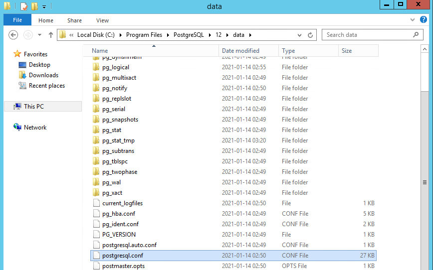

5. Extract zip file and run ```setup.exe```     
   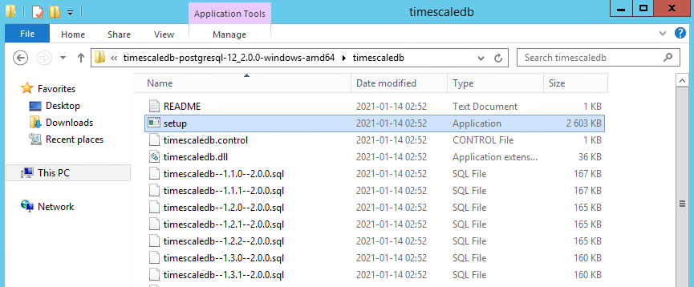

   * The first time you run it, you must allow it past the security gates. When this warning show up, click '```More info```'
   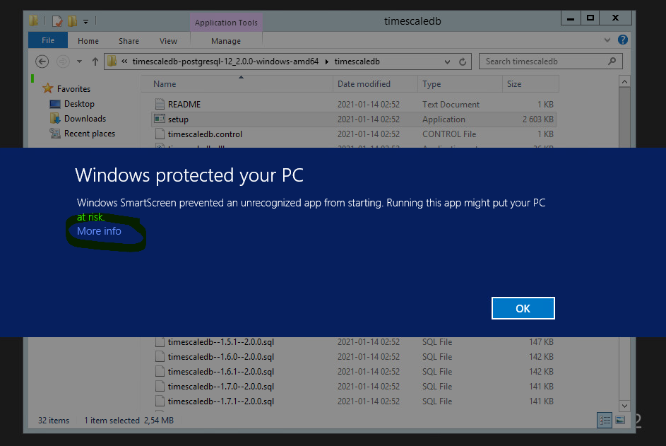

   * Click '```Run anyway```' to start the console based installation of TimescaleDB  
   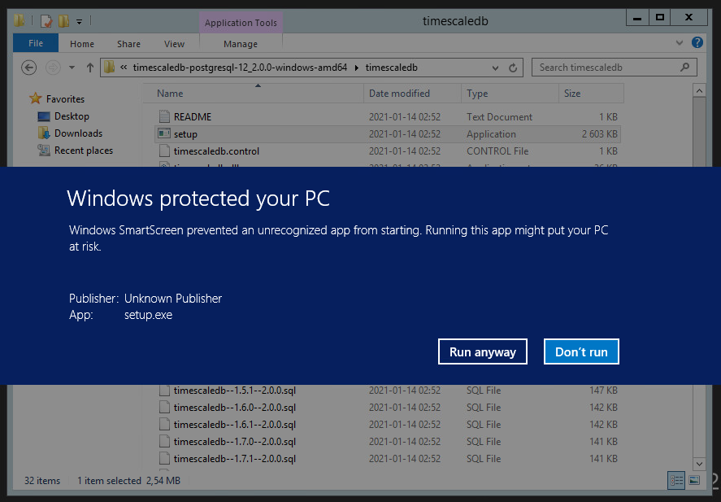

   * Press '```y```' to start the installation   
   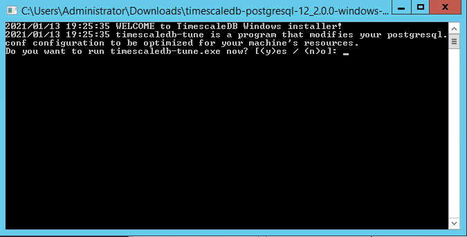

   * Enter the path to the ```postgresql.conf``` file and press '```Enter```'  
   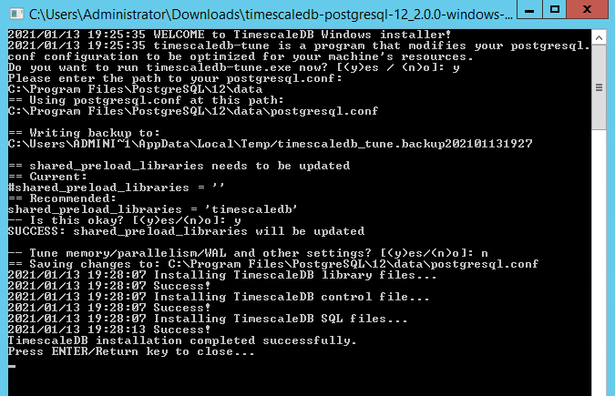

   * Press '```Enter```' again to exit the TimescaleDB installation

   * Restart the PostgreSQL service

6. Done

# PostgreSQL 12 installation instructions
These instructions and screenshots comes from a clean and updated version of __Microsoft Windows Server 2012 R2 Standard__ (Jan 13, 2021)
1. Download the latest PostgreSQL 12.x installation package for Windows from [here](https://www.enterprisedb.com/downloads/postgres-postgresql-downloads) https://www.enterprisedb.com/downloads/postgres-postgresql-downloads  
***It is important you download version 12 of PostgreSQL***
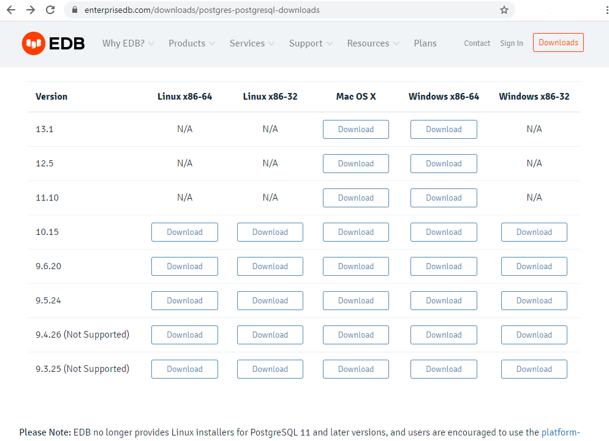

2. Run the downloaded executable to start the installation of PostgreSQL

3. Unless there are specific requirements regarding application and database storage locations, the default settings will install the application and database files to the C: drive.  
   * **Note down the path to location where the application binaries are stored** (e.g. ```C:\Program Files\PostgreSQL\12\bin```)  

   * **Remember the password entered in one of the dialogs!** It is needed to configure the database later

4. Complete all dialogues and skip the StackBuilder section

5. Update the PATH environment variable to include the path the PostgreSQL binaries
   * Right click on ```This PC``` in the explorer and then click ```Properties```
   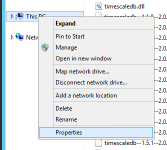

   * Click ```Advanced system settings``` in the dialogue that pops up
   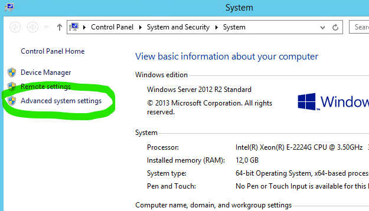

   * Click ```Environment Variables...``` in the dialogue that pops up
   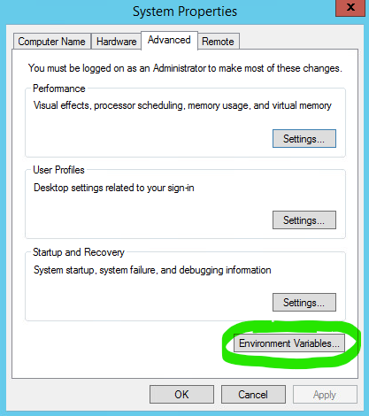

   * Find the ```PATH``` variable in the 'System variables' list and click ```Edit...```
   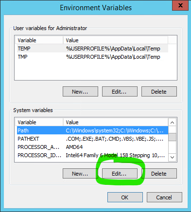

   * Append the path to the PostgreSQL binaries location. **NOTE** You must make sure to add a semi-colon between the existing string and the one you append. It separates the different paths in the variable.  
   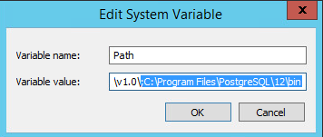

   * Click ```OK``` and close all dialogues

5. Done 

# Links
- [Official Timescale installation instructions](https://docs.timescale.com/latest/getting-started/installation/windows/installation-windows)
- [Timescale installation binaries (PostgreSQL 12 64-bit)](https://timescalereleases.blob.core.windows.net/windows/timescaledb-postgresql-12_2.0.0-windows-amd64.zip)