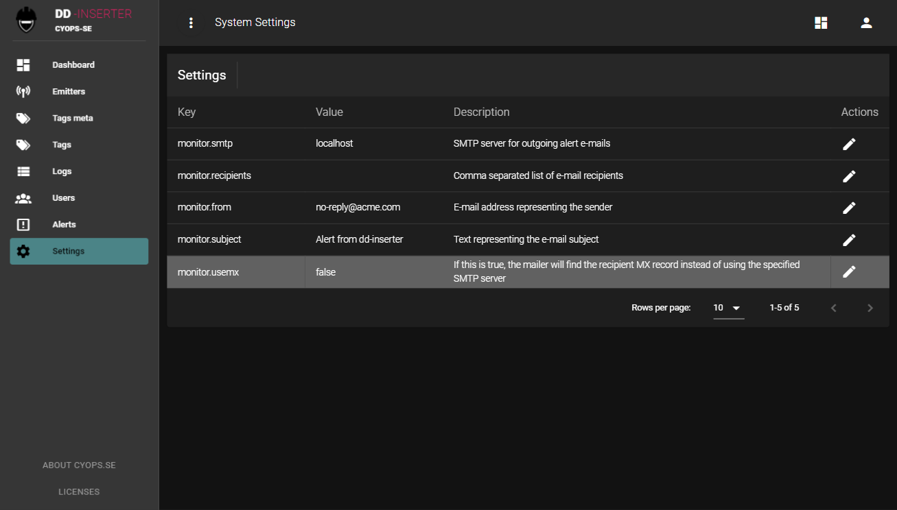

# dd-proxy - User Interface
**cyops-se**: *This application is part of the cyops.se community and use the same language and terminology. If there are acronyms or descriptions here that are unknown or ambiguous, please visit the [documentations](https://github.com/cyops-se/docs) site to see if it is explained there. You are welcome to help us improve the content regardless if you find what you are looking for or not*.

# Table of Contents
* [Register new user](#register-new-user)
* [Dashboard](#dashboard)
* [Emitters](#emitters)
* [Tags meta](#tagsmeta)
* [Tags](#tags)
* [Logs](#logs)
* [Users](#users)
* [Alerts](#alerts)
* [Settings](#settings)

A simple user interface is provided to configure, operate and monitor the application health. After the application is started from an account with persmissions to access the local OPC DA servers, use a modern web browser (not Internet Explorer) to access http://localhost:3000


There is no default user and it is possible to register new users without any separate approval. Click the 'Register here' link to get to the new user registration page.

# Emitters


**NOTE! In this version, the application is dependent on a TimescaleDB emitter as some meta information like description, location, unit, min, max, is stored there.**

The first thing you need to do (assuming you have installed and configured a Timescale database according to the instructions in the README) is to create a new TimescaleDB emitter with the connection string parameters for the target Timescale database.

It is possible to have several emitters and the application will iterate through them all in no defined order to process data that have passed the filters (defined in the [tags](#tags) section).

# Tags meta


In a new installation, this list is typically empty, but as soon as you have a working ```dd-opcda``` configuration and are receiving data from it, this list will automatically populate with ID and name which are the only required fields used to cross reference the actual timeseries table (see README for more information on table structure).

The additional fields are optional but can be modified by importing a CSV file according to the folloing format (one header line, semi-colon as delimiter):

```
inuse;name;description;min;max;unit
[x = inuse];[name];[description];[min];[max];[unit];
```

For example:
```
inuse;name;description;min;max;unit
x;Total Received;This entry is generated by the application;0.0;999.0;unit
```

After import, only entries that differ will be shown and the **SAVE CHANGES** button will light up. Clicking the button will commit the changes.

Using the **IMPORT TEXT** button does the same except it want the CSV content pasted in a text box rather than having the file uploaded.


# Tags


This list is also populated automatically from the data received from ```dd-opcda``` and is used by the engine for filtering of received values. There are four different update types (or filters)

| Update type | Description |
|-------------|-------------|
| Passthrough | Values will be forwarded to the emitters as soon as they are received. This option does not filter values |
| Interval | This option ensures received values are not forwarded to emitters faster than the specified interval (in seconds). |
| Deadband | This is an integrating deadband meaning the differences between the last forwarded value and the received values are accumulated. Once they reach the deadband threshold ```((integrator/lastforwardedvalue) > deadband)``` it will be passed through to the emitters, reset the integrator and use the last value as the last forwarded value |
| Disabled | Using this option will prevent the value from being forwarded to the emitters |

Use the **pen** icon to change update type and the **trash bin** to delete the tag temporarily (it will be automatically re-populated with default values)

# Logs


Simple log view listing all events in the system. Use the search feature to filter out events of interest and use column sorting e.g. to get the timeline in ascending or descending order.
**CLEAR ALL ENTRIES** wipes the log clean.

# Users


Simple list of registered users. It is possible to change name and e-mail for existing users or remove them from the system. There is currently no permissions or access rights associated, nor is there any audit logs.

# Alerts


The application monitors sequence numbers that are included in the message from ```dd-opcda``` in an attempt to detect problems, like packet loss. If the difference in sequence number is greater than 5 an alert is generated.

Alerts can be sent as e-mail provided there is a local, unauthenticated mail server available (which is not uncommon inside an organization). Use this view to enter information regarding mailserver and e-mail recipients.

# Settings


| Setting | Description |
|---------|-------------|
| monitor.smtp | This should point to a simple, unauthenticated, internal SMTP server to use for alert e-mails. Typically, you can use the [alerts](#alerts) view for managing this parameter instead |
| monitor.recipients | Recipient e-mails separated by a comma. Typically, you can use the [alerts](#alerts) view for managing this parameter instead |
| monitor.subject | The subject line to use in the alert e-mails |
| monitor.usemx | This option tells the engine to lookup recipient SMTP server rather than using the specified SMTP server |